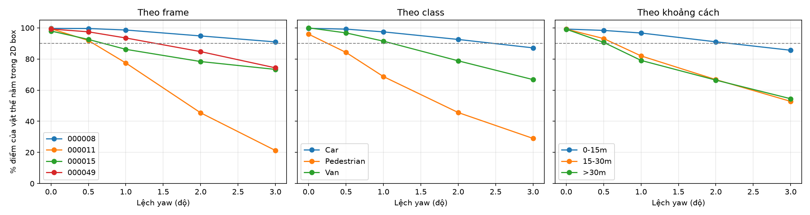
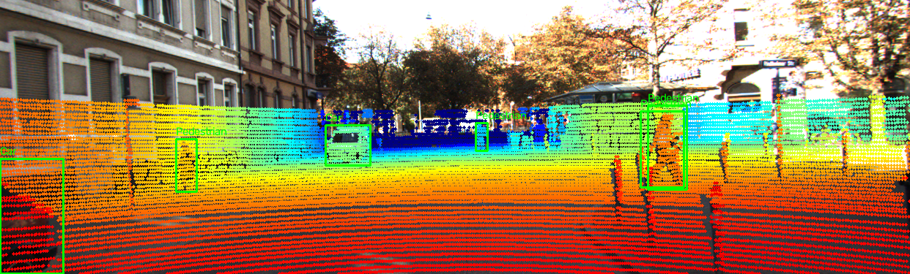
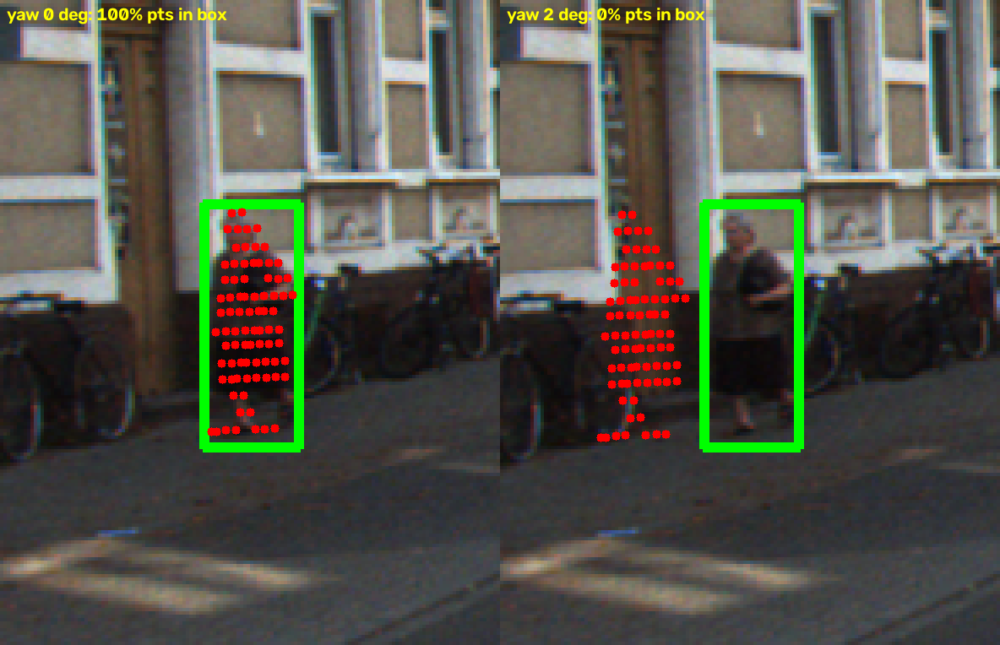

# Báo cáo Day 6: Độ nhạy của projection với lệch yaw

> Thay **mọi** ô có chữ ĐIỀN nằm trong ngoặc vuông bằng nội dung của bạn, xoá luôn cả dấu ngoặc vuông. Lệnh `python tools/check_submission.py` sẽ báo FAIL nếu còn sót bất kỳ chỗ nào.

- **Họ tên:** Nguyễn Văn Xuân Lộc
- **MSSV:** 2A202602870 (phải trùng với MSSV trong tên repo `<HoVaTen>-<MSSV>-Track4-Day21`)
- **Lớp:** AI20K-T4
- **Link repo:** https://github.com/xuanlocc2/NguyenVanXuanLoc-2A202602870-Track4-Day21
- **Topic:** A — LiDAR-camera projection QA
- **Dataset:** data/kitti_mini
- **Các frame đã dùng:** 000008, 000011, 000015, 000049

> Hãy viết ngắn: mỗi mục từ 3 đến 8 dòng, ưu tiên số liệu và hình ảnh.

## 1. Claim

Một câu khẳng định kỹ thuật có thể kiểm chứng. Ví dụ: *"Lệch yaw 1° làm 12% điểm LiDAR rơi ra khỏi vật thể ở 30 m, phát hiện được bằng edge-alignment score với ngưỡng X."*

Lệch yaw 1° làm tỉ lệ điểm LiDAR của người đi bộ rơi đúng vào 2D box giảm hơn 20 điểm phần trăm, trong khi với xe con chỉ giảm dưới 5 điểm phần trăm.

## 2. Evidence

Bảng hoặc plot số liệu, kèm ảnh/video demo. Ghi rõ đường dẫn file trong `results/`.

Metric: % điểm LiDAR nằm trong 3D box của vật thể (theo calib gốc) mà sau khi chiếu bằng calib bị lệch yaw vẫn rơi vào 2D box của label. Dữ liệu: `results/yaw_perturb_sweep.csv` (theo frame), `results/yaw_by_group.csv` (theo class và khoảng cách). Mỗi lần chỉ đổi yaw, không có phép ngẫu nhiên, chạy lại hai lần ra file giống hệt nhau.

| Lệch yaw | 000008 (đông xe) | 000011 (nhiều người đi bộ) | 000015 (người đi bộ) | 000049 (nhiều vật bị che) | Pedestrian (gộp) | Car (gộp) |
|---|---|---|---|---|---|---|
| 0° | 99.6% | 99.5% | 98.0% | 99.3% | 95.9% | 99.7% |
| 0.5° | 99.6% | 91.9% | 92.6% | 97.5% | 84.2% | 99.2% |
| 1° | 98.6% | 77.4% | 86.2% | 93.5% | 68.7% | 97.4% |
| 2° | 94.8% | 45.4% | 78.4% | 84.7% | 45.6% | 92.6% |
| 3° | 91.0% | 21.2% | 73.3% | 74.3% | 29.0% | 87.2% |





- Claim được xác nhận ở dạng gộp: ở 1°, người đi bộ giảm 27.2 điểm phần trăm (95.9% → 68.7%), xe con chỉ giảm 2.3 điểm (99.7% → 97.4%). Theo frame: 000011 giảm 22.0 điểm, 000008 giảm 1.0 điểm.
- Theo khoảng cách (gộp mọi class), ở 1°: vật 0–15 m còn 96.7%, vật 15–30 m còn 82.0%, vật trên 30 m còn 79.1%, vì lệch góc làm điểm trượt khoảng 12.6 px/độ bất kể khoảng cách trong khi vật xa nhỏ hơn trên ảnh.
- Mức sàn ở 0° là 98–99.6% theo frame (95.9% với người đi bộ) do label do người vẽ không khớp tuyệt đối, nên ngưỡng cảnh báo nên đặt khoảng 90%: người đi bộ (gộp) đã xuống dưới ngưỡng này ở 0.5° (84.2%), còn frame đông xe 000008 vẫn trên 90% đến tận 3° (91.0%).

**[B2]** Stress test suy giảm dữ liệu (`results/b2_degradation.csv`, `src/exp_bonus.py`): random dropout giữ 100 / 70 / 50 / 30% điểm và nhiễu Gaussian σ = 0 / 0.02 / 0.05 / 0.1 m (seed = 0), mỗi mức chạy với yaw 0 / 1 / 2°, trên frame 000008 và 000011. hit_ratio ở frame 000011:

| Suy giảm | hit_ratio yaw 0° | yaw 1° | yaw 2° | Số điểm trên vật (yaw 0°) |
|---|---|---|---|---|
| Không suy giảm | 99.4% | 77.4% | 45.4% | 725 |
| Giữ 50% điểm | 99.7% | 81.4% | 48.1% | 370 |
| Giữ 30% điểm | 100.0% | 84.8% | 49.1% | 215 |
| Nhiễu σ = 0.05 m | 99.3% | 76.8% | 44.6% | 676 |
| Nhiễu σ = 0.1 m | 98.3% | 74.9% | 42.8% | 591 |

Phép đo vẫn phân biệt được yaw 0° với 1° (giảm 15 đến 22 điểm phần trăm) ngay cả khi chỉ giữ 30% điểm, vì hit_ratio là tỉ lệ nên ít nhạy với số điểm. Khi giữ ít điểm, nó nhiễu hơn (chỉ còn 215 điểm trên vật, nên chênh lệch 77.4% so với 84.8% ở yaw 1° là dao động lấy mẫu, không phải xu hướng). Nhiễu 0.1 m làm mức sàn ở 0° giảm từ 99.4% xuống 98.3% và làm mất khoảng 18% số điểm trên vật do điểm nhiễu rơi ra ngoài 3D box (box được chọn trên điểm đã nhiễu).

**[B3]** Latency (`results/b3_latency.csv`): hàm chiếu 108 nghìn điểm KITTI frame 000011 rồi đếm điểm trong box (không tính đọc file), 21 lần chạy, bỏ lần đầu: **p50 = 35.5 ms, p95 = 38.4 ms**. Máy: AMD Ryzen 9 6900HS, 15.2 GB RAM, chỉ chạy CPU (numpy, không GPU). Với p50 này, kiểm tra alignment 1 frame mỗi giây vẫn dùng rất ít tài nguyên.

**[B5]** So sánh KITTI và nuScenes (`results/b5_kitti_vs_nuscenes.csv`), hit_ratio theo yaw:

| Frame | 0° | 0.5° | 1° | 2° | 3° | Số điểm trên vật (0°) |
|---|---|---|---|---|---|---|
| KITTI 000008 | 99.6% | 99.6% | 98.6% | 94.8% | 91.0% | 5127 |
| KITTI 000011 | 99.4% | 91.9% | 77.4% | 45.4% | 21.2% | 725 |
| nuScenes scene-0103_010 (ngày) | 100% | 97.0% | 90.7% | 75.0% | 65.2% | 100 |
| nuScenes scene-0103_020 (ngày) | 100% | 97.6% | 95.3% | 86.9% | 78.0% | 243 |
| nuScenes scene-1094_010 (đêm) | 100% | 100% | 96.7% | 86.4% | 75.2% | 359 |
| nuScenes scene-1094_020 (đêm) | 100% | 92.5% | 86.7% | 73.8% | 63.2% | 90 |

Tiêu cự nuScenes (1253–1266 px) lớn hơn KITTI (721 px) khoảng 1.74 lần, nên cùng lệch 1° điểm trượt 21.9 px thay vì 12.6 px, nhưng ảnh nuScenes cũng rộng hơn và vật cũng chiếm nhiều pixel hơn. Tỉ số độ trượt so với bề rộng vật là θ·z/W, trong đó f triệt tiêu, nên khác biệt giữa hai dataset đến từ tập vật thể (khoảng cách, kích thước), không đến từ tiêu cự. nuScenes ít điểm trên vật hơn nhiều (90–359 điểm so với 725–5127 do LiDAR 32 beam), nên kết quả có nhiễu lấy mẫu lớn hơn. Mức sàn 100% ở 0° của nuScenes khác KITTI (98–99.6%); tôi chưa kiểm chứng nhưng nhiều khả năng do cách tạo 2D box của hai dataset khác nhau. Chưa phân tách được ảnh hưởng của ban ngày so với ban đêm, vì mỗi điều kiện chỉ có 2 frame và số điểm trên vật dao động rất mạnh giữa các frame.

## 3. Failure case

Nêu khi nào hệ thống hoặc phương pháp fail, vì sao fail, và liên hệ tới lớp nào trong 6 lớp debug: I/O, Geometry, Time, Preprocess, Model, Metric.



- **Trường hợp:** KITTI, frame 000011, người đi bộ thứ 6 (obj 5) ở 15.9 m, 2D box rộng 27.7 px, 81 điểm LiDAR. Chiếu bằng calib lệch yaw 0° / 0.5° / 1° / 2°.
- **Quan sát:** tỉ lệ điểm nằm trong 2D box giảm 100% → 81% → 35% → 0% (yaw 0 / 0.5 / 1 / 2°). Ở 2° cả cụm điểm trượt sang trái, nằm hoàn toàn ngoài box (ảnh bên phải). Người ở 34 m (box 15.3 px) mất 92 điểm phần trăm chỉ với 1°. Kết quả sơ bộ: mức giảm phụ thuộc bề rộng box trên ảnh chứ không phụ thuộc loại vật. Xe ở 33 m (box 51 px) cũng mất 24 điểm phần trăm ở 1°, còn xe gần (box ≥ 123 px) mất dưới 2 điểm phần trăm. Số liệu: `results/fail_yaw_objects.csv`.
- **Nguyên nhân:** xoay yaw θ làm điểm trượt khoảng f·tan(θ) pixel, gần như không đổi theo khoảng cách (f = 721.5 px: 1° ≈ 12.6 px, 2° ≈ 25.2 px), mà người đi bộ chỉ rộng 27.7 px nên 2° đủ đẩy cả cụm điểm ra ngoài box.
- **Lớp debug:** Geometry (extrinsic `Tr_velo_to_cam` sai). Kèm lớp Metric: "số điểm nằm trong ảnh" gần như không đổi khi lệch (data/synthetic, frame 000000: 3910 → 3956 ở yaw 2°), nên không phát hiện được lỗi này.
- **Cách phát hiện khi chạy thật:** theo dõi tỉ lệ điểm LiDAR nằm trong 2D box của vật mà detector ảnh phát hiện được (người đi bộ, cột), cảnh báo khi giảm dưới 90% so với lúc mới calibrate. Không dùng "% điểm nằm trong ảnh" làm chỉ số cảnh báo.

## 4. Khuyến nghị nếu triển khai thật

**Use-case:** xe tự lái / ADAS dùng LiDAR + camera. Khung gầm rung và va chạm nhẹ có thể làm giá đỡ cảm biến bị lệch vài phần mười độ mà không ai nhận ra, trong khi detector vẫn chạy bình thường.

- **Kiểm tra alignment mỗi lần khởi động và định kỳ khi chạy:** với các vật hẹp mà detector ảnh nhận ra (người đi bộ, cột), đo tỉ lệ điểm LiDAR nằm trong 2D box. Cảnh báo khi tỉ lệ trung vị xuống dưới 90% trên ít nhất 3 frame liên tiếp. Với KITTI, ngưỡng này bắt được lệch yaw khoảng 0.5° ở người đi bộ (84.2%) nhưng chỉ bắt được xe con khi lệch tới trên 3° (87.2%), nên phải ưu tiên vật hẹp làm "vật thử".
- **Đánh đổi:** ngưỡng 90% chỉ cách mức sàn của người đi bộ (95.9% khi calibration đúng) khoảng 6 điểm phần trăm, nên dễ báo nhầm nếu ít mẫu hoặc 2D box lệch. Cần đủ số điểm (khuyến nghị ít nhất 30–50 điểm trên mỗi vật) và gộp theo trung vị. Cách này phụ thuộc detector ảnh nên không dùng được ban đêm hoặc khi camera mù.
- **Chỉ số cần ghi log:** hit_ratio trung vị theo class và theo khoảng cách (0–15 / 15–30 / trên 30 m), số điểm dùng để tính, độ lệch thời gian LiDAR-camera. Không dùng "% điểm nằm trong ảnh" làm chỉ số sức khoẻ vì nó gần như không đổi khi lệch (xem mục 3).
- **Bước tiếp theo:** thử trên nuScenes (LiDAR thưa hơn, có lệch thời gian), thêm kiểm tra lệch tịnh tiến, và đo ngưỡng trên nhiều frame hơn: hiện chỉ có 4 frame KITTI nên các số trên chưa đủ để chốt ngưỡng sản phẩm.

## 5. Cách chạy lại

Các lệnh tái tạo lại toàn bộ kết quả từ repo sạch (đã kiểm tra trên Windows, Python 3.13).

```bash
python -m venv .venv && source .venv/Scripts/activate   # Linux/macOS: source .venv/bin/activate
pip install -r requirements.txt
python tools/verify_data.py --data-root data/kitti_mini
python -m starter.projection --data-root data/kitti_mini --frame 000011   # ảnh demo overlay, ra results/figures/
python -m src.exp_yaw_sweep      # results/yaw_perturb_sweep.csv, results/yaw_by_group.csv
python -m src.plot_yaw_sweep     # results/figures/yaw_sweep.png
python -m src.yaw_failure        # results/fail_yaw_objects.csv, results/figures/fail_01_yaw_pedestrian.png
python -m src.exp_bonus          # bonus B2, B3, B5: results/b2_degradation.csv, b3_latency.csv, b5_kitti_vs_nuscenes.csv
```

## 6. Khai báo sử dụng AI

Ghi rõ đã dùng công cụ AI nào, dùng vào việc gì, và bạn đã tự kiểm chứng kết quả đó bằng cách nào. Nếu không dùng AI, ghi "Không sử dụng". Xem quy định ở `RULES.md` mục 2.

| Công cụ | Dùng cho việc gì | Bạn đã kiểm chứng thế nào |
|---|---|---|
| Claude Code (Claude Sonnet 5.5) | Fork repo, cài môi trường, viết 2 hàm TODO trong `starter/projection.py`, viết `src/yaw_failure.py`, `src/exp_yaw_sweep.py`, `src/plot_yaw_sweep.py`, soạn nội dung REPORT | Số liệu 3 frame 000008/000011/000049 khớp bảng kỳ vọng của đề; điểm (10,0,0) ra pixel (614,175); chạy lại thí nghiệm hai lần ra file CSV giống hệt; xem ảnh failure bằng mắt |
| Script mẫu của codelab (Phần 05) | `src/exp_yaw_sweep.py` và `src/plot_yaw_sweep.py` lấy làm điểm xuất phát | Mở rộng: tách kết quả theo class và khoảng cách, thêm frame 000015, thêm `results/yaw_by_group.csv` |
